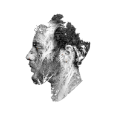

# Kieran Poropat – Portfolio Website



Welcome to my **portfolio website**, showcasing selected **projects, design prototypes, and creative work**. This site demonstrates my skills in **web development, React/React Native, full-stack development, and UI/UX design** through interactive, clean, and responsive projects.

---

## 📂 Table of Contents

- [Features](#features)
- [Tech Stack](#tech-stack)
- [Highlighted Projects](#highlighted-projects)
- [Design Work](#design-work)
- [Installation](#installation)
- [Usage](#usage)
- [Credits](#credits)
- [License](#license)

---

## ✨ Features

- **Project Showcases:** Full-stack and front-end React projects, design system tools, and prototypes.
- **Responsive Design:** Mobile-first, accessible on all devices.
- **Interactive Galleries:** Videos, image galleries, and dynamic showcases.
- **Progressive Web App (PWA):** Installable with offline support and fast performance.

---

## 🛠️ Tech Stack

- **Frontend:** HTML5, CSS3, JavaScript (ES6+), React
- **Backend:** Node.js, Express.js, MongoDB (for full-stack projects)
- **Tools:** Git, GitHub, Figma, VS Code, Material Icons
- **Features:** PWA, service workers, JWT authentication (in full-stack projects)

---

## 🌟 Highlighted Projects

- **[RAWG Full-Stack Gaming App](https://github.com/poro0002/rawg_fullstack):**  
  React + Node + MongoDB app fetching live gaming data with JWT authentication and service workers for offline support.

- **[Synthesis React Native App](https://github.com/poro0002/Synthesis_android_app):**  
  A React Native app that helps designers build consistent design systems efficiently.

- **[Nike x OFF-WHITE Landing Page](https://github.com/poro0002/nike-offwhite-proto-redone):**  
  A clean, responsive front-end prototype replicating branded landing experiences with modern layout and animation.

---

## 🎨 Design Work

- **Halo Infinite Main Menu Concept:** Video preview showcasing UI/UX design exploration.
- **Black Myth: Wukong Mockup:** High-fidelity UI/UX design.
- **Valorant UI Mockup:** Video showcasing a concept menu and in-game UI.
- **Nike OFF-WHITE Mockups:** Interactive gallery for iPad/iPhone concepts.
- **Movie Posters & Cover Art:** Interactive galleries showcasing design and branding work.
- **Character Concept Sketches:** Gallery showcasing character and concept art.

---

## ⚙️ Installation

1. Clone this repository:
   ```bash
   git clone https://github.com/poro0002/mad9013-project-portfolio.git
   ```
2. Open `index.html` in your browser, or deploy using GitHub Pages for live viewing.

---

## 🚀 Usage

- Explore projects, design work, and prototypes directly in your browser.
- Review responsive design principles and interactive UI elements.
- Use as a personal showcase for potential employers and clients.

---

## 🙏 Credits

- **Kieran Poropat:** [GitHub](https://github.com/poro0002) | [LinkedIn](https://www.linkedin.com/in/kieran-poropat) | [Dribbble](https://dribbble.com/KieranPoropat)
- **Material Icons:** [Material Icons](https://material.io/resources/icons/)

---

## 📄 License

This project is licensed under the MIT License. See the [LICENSE](LICENSE) file for details.
